# AWS VPC Architecture


### Overview

Built a custom VPC on AWS from scratch with public and private subnets to establish network isolation between internet-facing and internal resources.

Configured the full networking stack:
- **Internet Gateway** for public subnet internet access
- **NAT Gateway** for secure outbound connectivity from the private subnet
- **Route tables** to control traffic flow between subnets and the internet
- **Security groups** to restrict access at the instance level
- **Bastion host** as a secure entry point to private resources

Launched EC2 instances in both subnets and verified connectivity end-to-end — including SSH through the bastion and outbound internet access from the private subnet via the NAT Gateway.

### Architecture Diagram

> See [diagrams/vpc-architecture.md](diagrams/vpc-architecture.md) for the full architecture diagram.

---

## Step 1 — Create the VPC

Created a VPC to define an isolated virtual network in AWS.

- Name: `Lab VPC`
- IPv4 CIDR: `10.0.0.0/16` (65,536 IP addresses)
- DNS Hostnames: Enabled — so EC2 instances receive public DNS names
- DNS Resolution: Enabled

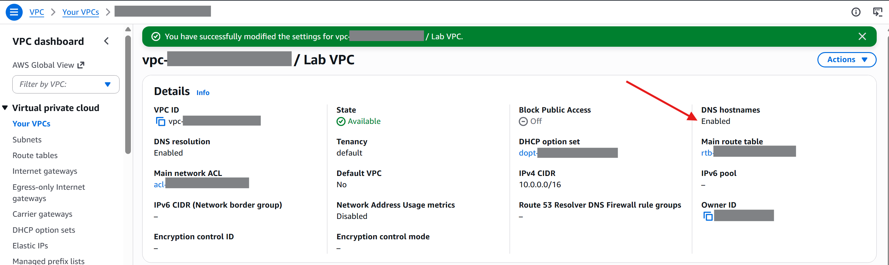

---

## Step 2 — Create Subnets

Created two subnets inside the VPC to separate public-facing and internal resources.

Public Subnet | `10.0.0.0/24` (256 IPs) | Bastion host, NAT Gateway  
Private Subnet | `10.0.2.0/23` (512 IPs) | Backend instances 

The private subnet is intentionally larger — most resources should be kept private unless they specifically need internet access.

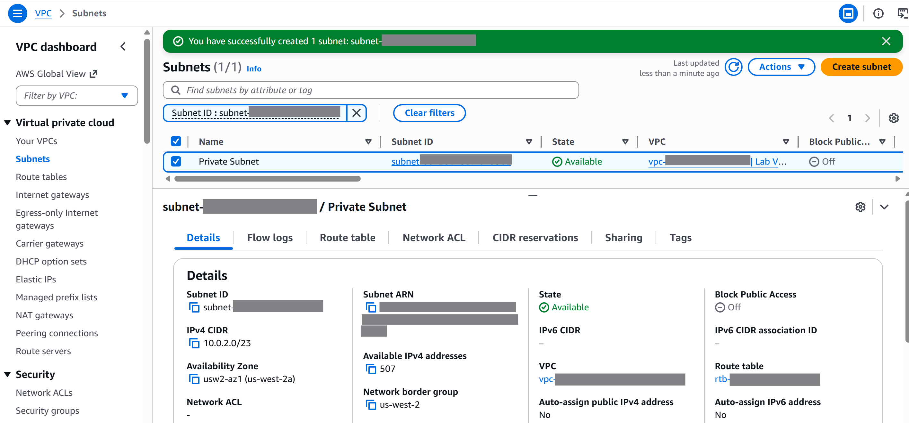

Enabled auto-assign public IPv4 on the Public Subnet so instances launched there automatically get a public IP.

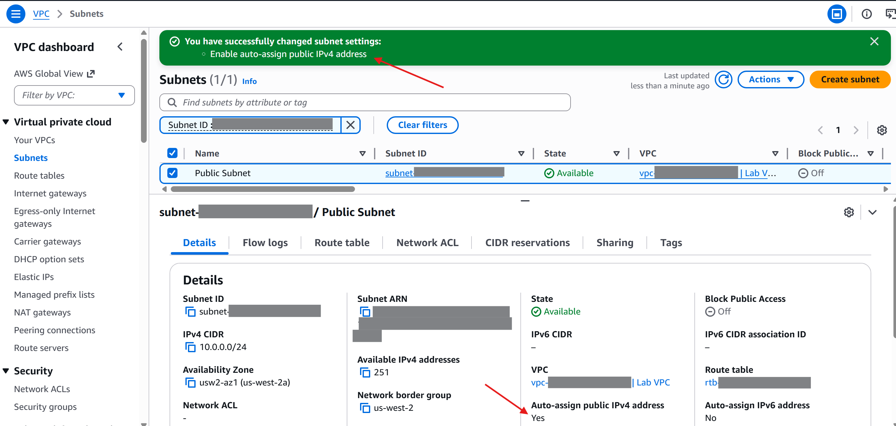

---

## Step 3 — Create and Attach Internet Gateway

An Internet Gateway is the "door" between the VPC and the internet.

- Name: `Lab IGW`
- Attached to: `Lab VPC`

Without an internet gateway, nothing inside the VPC can communicate with the outside world.

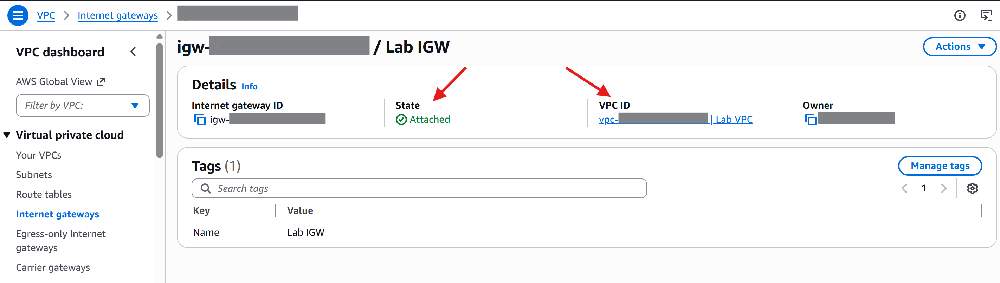

---

## Step 4 — Configure Route Tables

Route tables act as a "GPS" for network traffic — they decide where packets go.

**Public Route Table:**  
Associated with Public Subnet

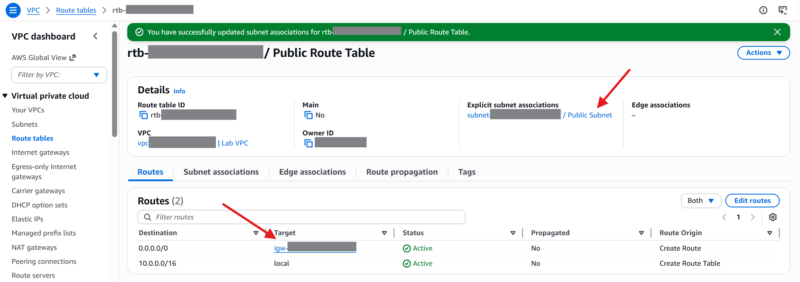

**Private Route Table (default):**  
The private subnet has no route to the internet at this point — it is fully isolated.

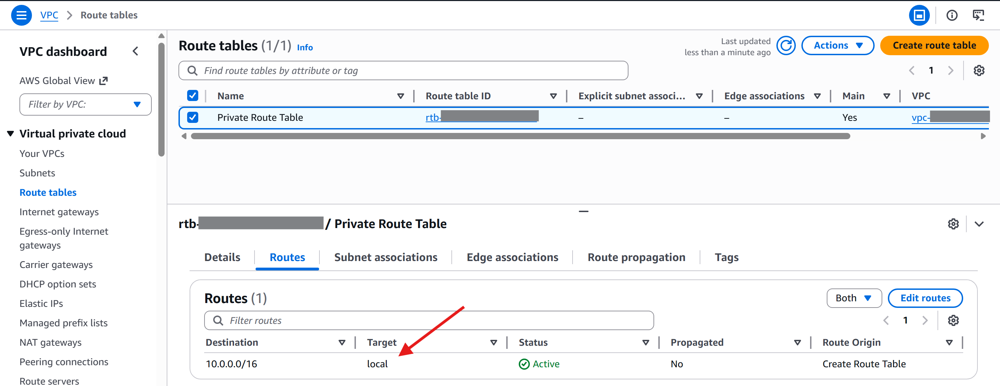

---

## Step 5 — Launch Bastion Server in Public Subnet

A bastion server (jump box) is a secure entry point to reach private resources.

- Name: `Bastion Server`
- AMI: Amazon Linux 2023
- Instance type: t3.micro
- Subnet: Public Subnet
- Public IP: Auto-assigned
- Key pair: None (using EC2 Instance Connect)
- Security Group: `Bastion Security Group` — allows SSH (port 22) from anywhere

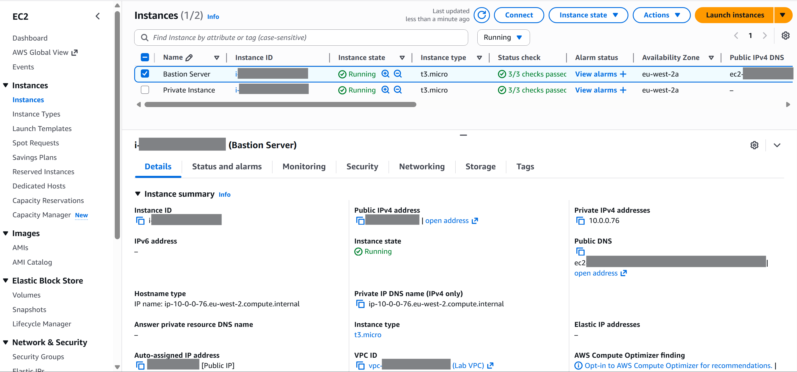

---

## Step 6 — Create NAT Gateway

A NAT Gateway allows private instances to reach the internet (for updates, patches) without being directly accessible from outside.

- Name: `Lab NAT gateway`
- Placed in: Public Subnet
- Elastic IP: Allocated and associated

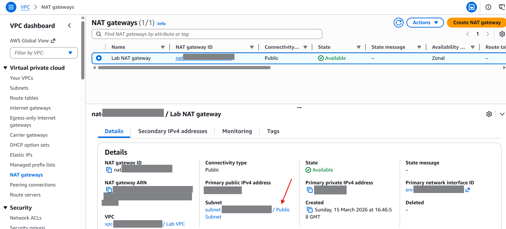

Then updated the Private Route Table:  

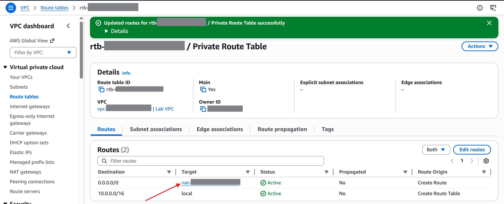

Now private instances can initiate outbound connections, but the internet cannot initiate inbound connections to them.  

---

## Step 7 — Launch Private Instance

Launched a second EC2 instance in the private subnet to demonstrate network isolation.

- Name: `Private Instance`
- AMI: Amazon Linux 2023
- Instance type: t3.micro
- Subnet: Private Subnet
- No public IP
- Security Group: `Private Instance SG` — allows SSH (port 22) only from `10.0.0.0/16` (VPC internal traffic)

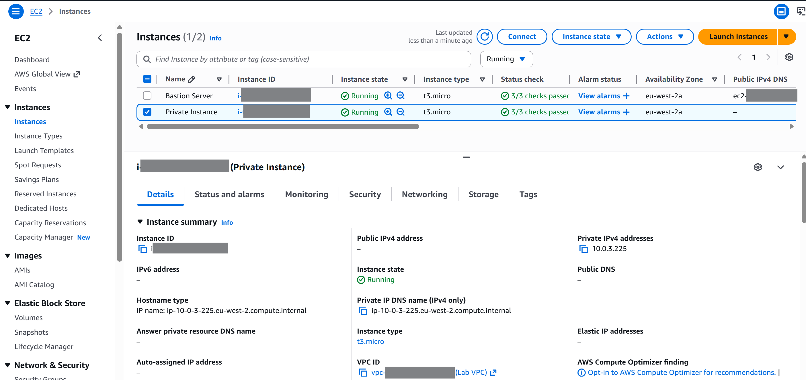

---

## Step 8 — Connect: Bastion → Private Instance

Connected to the Bastion Server via EC2 Instance Connect, then SSH'd into the Private Instance using its private IP.

```bash
# From Bastion Server terminal:
ssh PRIVATE-IP
```

After accepting the host key fingerprint and entering the password, the connection was established successfully.

This demonstrates the bastion host pattern — the private instance is not reachable from the internet, only from within the VPC.

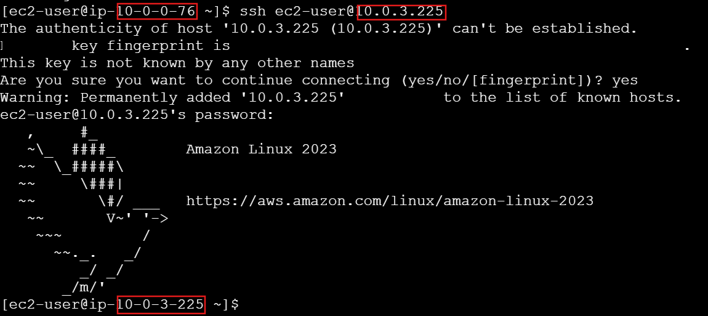

---

## Step 9 — Verify NAT Gateway (Ping Test)

From the private instance, ran a ping to confirm outbound internet access through the NAT Gateway.

First attempt — `amazon.com` resolved via DNS but returned no ICMP replies:

```bash
$ ping -c 3 amazon.com
```
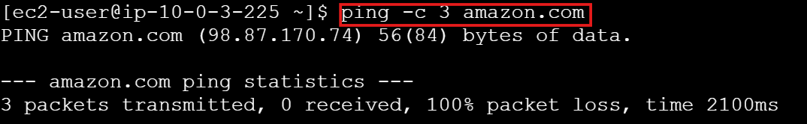


## Troubleshooting steps taken:
- Verified NAT Gateway status → `Available`
- Verified Private Route Table → `0.0.0.0/0` pointed to NAT Gateway
- Verified subnet association → Private Subnet linked to Private Route Table
- Verified Security Group outbound rules → `All traffic` allowed
- Ran `curl` to test HTTP connectivity → worked
- Conclusion: `amazon.com` blocks ICMP (ping) — the network was configured correctly

Confirmed with `google.com`:

```bash
$ ping -c 3 google.com
```

The private instance successfully reached the internet.

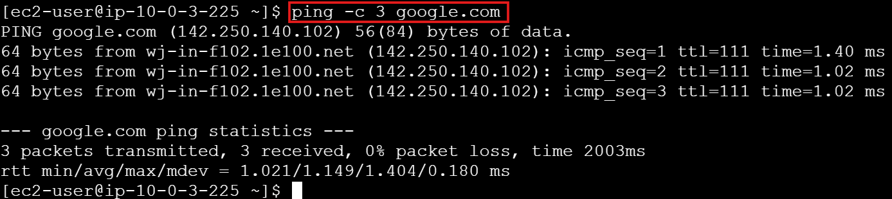

---

## Security Design

| Security Group | Inbound Rule | Applied To |
|---------------|-------------|------------|
| Bastion Security Group | SSH (22) from `0.0.0.0/0` | Bastion Server |
| Private Instance SG | SSH (22) from `10.0.0.0/16` | Private Instance |

The private instance only accepts connections from within the VPC — you must go through the bastion server first.

---

## AWS Services Used

- Amazon VPC
- Amazon EC2
- Internet Gateway
- NAT Gateway
- Route Tables
- Security Groups
- Elastic IP

## Key Concepts Demonstrated

- Network isolation — public vs private subnets
- Bastion host pattern — secure access to private resources
- NAT Gateway — outbound internet for private instances without inbound exposure
- Least privilege — security groups restrict access to the minimum needed
- Route table design — separate routing for public and private traffic
