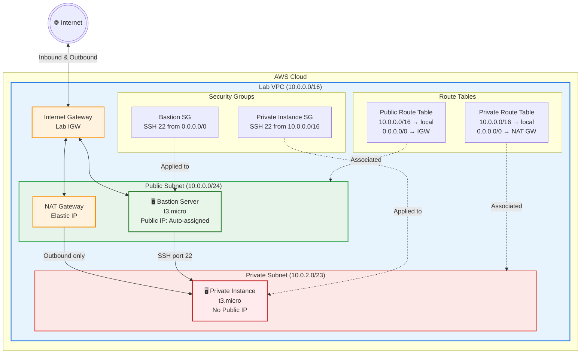

# Multi-Tier VPC Architecture Diagram

## Traffic Flow

1. **User → Bastion**: User connects via SSH through Internet Gateway to Bastion Server in Public Subnet
2. **Bastion → Private Instance**: SSH from Bastion to Private Instance using private IP
3. **Private Instance → Internet**: Outbound traffic goes through NAT Gateway (for updates, patches) — no inbound from internet
